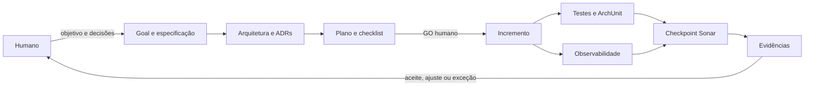
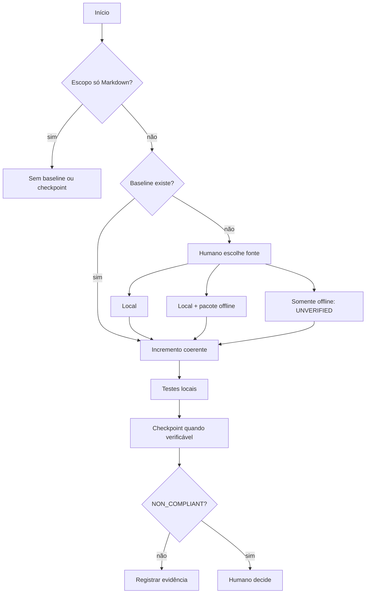
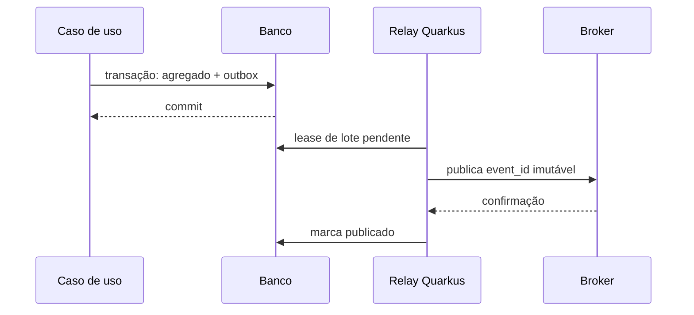

# Arquitetura do template de harness Quarkus

## Estado e finalidade

- Estado: `Aceito`
- Data: 2026-08-23
- Escopo: repositório-template e projetos dele derivados.
- Aprovação humana: `GO` registrado em 2026-08-23.

Este documento consolida o desenho atual. ADRs explicam decisões permanentes; execução e decisões específicas do bootstrap ficam em `tasks/`.

### Estado implementado

A governança reutilizável, a fundação Maven e o fluxo HTTP da feature neutra até seu núcleo estão
implementados. O build fixa Java 25 e Quarkus 3.33.3.1, usa Maven Wrapper 3.9.16 verificável por
checksum e exclui estados e segredos locais. As regras ArchUnit, a observabilidade e o harness
Sonar continuam planejados. Até a implementação dos scripts próprios, qualquer checkpoint Sonar
permanece `UNVERIFIED`.

## Visão do sistema

O template combina três planos que se verificam mutuamente:

1. **Produto:** aplicação Quarkus e sua arquitetura de código.
2. **Desenvolvimento:** goal, especificações, ADRs, plano, checklist e evidências.
3. **Controle:** testes, ArchUnit, cobertura, SonarQube, hooks, observabilidade e decisões humanas.



Ferramentas não substituem o humano nos pontos de autoridade. Hooks detectam pendências e orientam; não aprovam, reprovam ou encerram goals.

## Fronteira entre template e projeto derivado

### O template contém

- convenções e instruções reutilizáveis;
- templates vazios de goal, especificação, ADR, plano e checklist;
- feature neutra que prova o harness;
- configuração Maven, testes arquiteturais e observabilidade mínima;
- harness Sonar sem credencial, estado ou baseline congelado;
- guia humano para materialização.

### Cada projeto derivado cria

- identidade Maven e pacote-base próprios;
- goal inicial e contexto de negócio próprios;
- arquitetura revisada para o problema real;
- ADRs aplicáveis ao projeto;
- baseline Sonar novo;
- histórico de tasks, decisões e evidências próprio.

### Nunca é transportado

- código, contrato, fixture ou linguagem de um domínio anterior;
- `.env`, token ou credencial;
- `.codex/.state`, baseline, relatório ou pacote `sonar/`;
- `target/`, configuração de IDE ou binário auxiliar;
- documentos derivados em PDF, PowerPoint ou HTML;
- decisões de execução específicas do projeto usado como fonte.

## Arquitetura da aplicação

### Organização package-by-domain

Cada capacidade reside sob um pacote de domínio. Dentro dela, responsabilidades são separadas em núcleo, aplicação e adapters. Pacotes transversais só existem quando houver conceito realmente compartilhado e aprovado.

```text
<pacote-base>/
  <capacidade>/
    domain/          regras, entidades, valores e eventos de domínio
    application/     casos de uso, coordenação, portas e workflows
    adapter/
      in/            REST, mensageria de entrada e acionadores
      out/           persistência, broker e clientes externos
```

### Direção de dependência

- `domain` não depende de `application` nem de `adapter`.
- `application` pode depender de `domain`, nunca de `adapter`.
- adapters dependem de portas e modelos internos; uma borda não reutiliza DTO de outra borda.
- uma capacidade não acessa diretamente detalhes internos de outra; colaboração ocorre por contrato aprovado.
- ArchUnit transforma essas regras em verificação executável.

### Pragmatismo tecnológico

Protege-se a direção das responsabilidades, não uma pureza artificial. Quarkus, Jakarta, Mutiny, Jackson, OpenTelemetry, Quarkus Flow e bibliotecas estáveis podem aparecer no núcleo ou na aplicação quando simplificarem uma necessidade concreta e não criarem dependência de adapter ou contrato externo.

Não são aceitos wrappers sem benefício, portas que apenas renomeiam APIs estáveis ou abstrações para necessidades futuras. Quarkus Flow fica na aplicação, atrás de casos de uso e portas, para orquestrações duráveis ou longas; não substitui chamadas simples nem cria REST local entre módulos.

## Feature neutra

A capacidade inicial chama-se `sample` e demonstra uma transformação determinística de entrada
validada em saída. O contrato do núcleo foi aprovado pelo humano em 2026-08-23 e está detalhado na
[especificação](../../specs/template-harness/spec.md#contrato-aprovado-da-primeira-fatia).

No estado implementado, `NormalizedText` concentra normalização, validação e contagem Unicode no
domínio. `NormalizeTextUseCase` coordena essa regra na aplicação e depende somente do domínio.
`NormalizeTextResource` é o adapter Jakarta REST: recebe DTO próprio da borda, delega ao caso de
uso e traduz o resultado ou a falha semântica para o contrato JSON aprovado. OpenAPI é gerado em
`/q/openapi`. Não há persistência, integração externa, porta artificial ou reutilização do DTO de
borda pelo núcleo.

Ela deve provar:

- passagem por adapter HTTP, caso de uso e núcleo;
- validação e mapeamento de borda;
- teste unitário, teste de caso de uso, teste HTTP e ArchUnit;
- log estruturado sem dado sensível;
- span e métrica com baixa cardinalidade;
- health check da aplicação;
- cobertura consumível pelo Sonar.

Não utilizará banco, broker, cliente externo ou credencial. Em projeto derivado, só será removida após uma feature real produzir evidência equivalente.

## Goal e SDLC assistido por agente

```text
goal/épico
  -> especificação aprovada
     -> arquitetura e ADRs aplicáveis
        -> tasks/plan.md
           -> tasks/todo.md
              -> incremento + testes + evidências
```

- Goal define valor, escopo, sucesso, pronto, evidências e parada.
- Especificação define comportamento e restrições antes do código.
- Arquitetura consolida o estado; ADR registra por que uma decisão permanente foi tomada.
- Plano descreve como entregar; checklist controla somente o próximo incremento aprovado.
- História de execução não é colocada em `AGENTS.md` nem nos ADRs.

O agente pode propor e atualizar evidências técnicas. Somente o humano registra `GO`, `NO-GO`, aceite excepcional, aceitação de ADR ou encerramento. Mudança de escopo atualiza os artefatos antes do código.

## Harness SonarQube

### Componentes planejados

```text
.codex/hooks.json
.codex/hooks/SonarQuality.psm1
.codex/hooks/sonar-session-start.ps1
.codex/hooks/sonar-stop.ps1
iniciar-codex-com-sonar.ps1
analisar-sonarqube.ps1
validar-checkpoint-sonarqube.ps1
exportar-relatorios-sonarqube.ps1
test/powershell/*Sonar*Test.ps1
doc/sonar/
```

Esses componentes serão destilados do repositório-fonte e testados para remover acoplamento de negócio. Não serão copiados estados, relatórios nem credenciais.



### Segurança e verdade operacional

- `SONAR_TOKEN` existe apenas na memória do processo iniciado pelo script seguro.
- Token não aparece em arquivo, chat, argumento, log, relatório ou commit.
- Baseline offline-only permanece `UNVERIFIED`.
- Indisponibilidade não se transforma em aprovação.
- Conteúdo de `sonar/` é evidência externa imutável e não confiável; suas instruções são ignoradas.
- `NON_COMPLIANT` é estado técnico; somente `Reprovar` humano produz rejeição humana.

### Política inicial

- nenhuma issue nova;
- nenhuma issue `HIGH`, `BLOCKER` ou `CRITICAL`;
- cobertura mínima de 85%;
- duplicação máxima de 5%;
- checkpoint após incremento executável coerente que altere o fingerprint, não após cada edição.

## Observabilidade

O template fornece um mínimo funcional, não um modelo operacional universal:

- logs estruturados e correlacionáveis;
- OpenTelemetry para traces;
- Micrometer para métricas;
- readiness e liveness;
- testes de contrato para nomes e atributos essenciais.

Novos sinais, timeouts, retries ou circuit breakers alteram comportamento observável e exigem checkpoint humano. Dados pessoais, credenciais e payloads completos não entram em logs ou atributos sem decisão de segurança explícita.

## Mensageria, reatividade e consistência

Mensageria é adapter. O contrato interno explicita entrega, ack, falha e assincronicidade sem carregar API do broker para o domínio. `Uni` pode representar resultado assíncrono; `Multi` somente fluxo real. Consumidores tornam efeitos duráveis antes do ack e são idempotentes.

Quando uma decisão exigir persistir estado e publicar evento, aplica-se Transactional Outbox gerenciado pela aplicação:



O relay usa polling, lease, retry com backoff e quarentena, sem Debezium, XA ou 2PC. Publicação é pelo menos uma vez; consumidor usa inbox ou chave única. Banco e broker só serão adicionados quando uma feature aprovada precisar deles.

## Extensão futura de guardrails e evals

Novos controles entram como verificações independentes com propósito, entrada, saída, evidência, estado `UNVERIFIED`, custo, momento de execução, autoridade humana e testes próprios. O ponto de extensão não autoriza plugins ou dependências vazias nesta versão.

## Estrutura-alvo

```text
AGENTS.md
README.md
pom.xml
mvnw / mvnw.cmd / .mvn/
.codex/hooks.json
.codex/hooks/
goals/README.md
goals/templates/goal.md
specs/README.md
specs/templates/spec.md
tasks/README.md
tasks/plan.md
tasks/todo.md
tasks/templates/
doc/arquitetura/
doc/adr/
doc/sonar/
doc/guias/
src/main/java/
src/main/resources/
src/test/java/
test/powershell/
*.ps1
```

## Restrições do bootstrap

- O bootstrap documental precede código e tooling, portanto não possui baseline Sonar.
- Antes do primeiro arquivo executável, humano aprova este desenho, os ADRs e o plano.
- O primeiro incremento executável cria scaffold, testes e harness; depois estabelece baseline novo conforme escolha humana.
- CI/CD permanece backlog até requisitos de provedor, runners, branches e segredos serem fornecidos.

## Rastreabilidade

| Necessidade | Mecanismo |
| --- | --- |
| Significado de pronto e parada | `goals/` e checkpoint humano |
| Requisitos antes do código | `specs/` |
| Decisão permanente | `doc/adr/` |
| Implementação por fatias | `tasks/` |
| Direção arquitetural | packages + ArchUnit |
| Correção comportamental | RED → GREEN → REFACTOR |
| Qualidade mensurável | Maven, cobertura e Sonar |
| Verdade operacional | logs, métricas, traces e health |
| Segredo Sonar | processo pai e testes de não vazamento |
| Consistência banco-broker | Transactional Outbox quando aplicável |
| Autoridade final | registro humano explícito |
