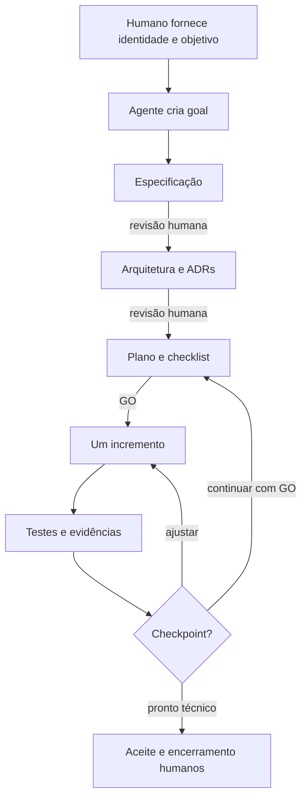

# Guia humano — Por onde começar

## Para quem é este guia

Este é o ponto de entrada para qualquer pessoa que acesse o repositório sem conhecer seu histórico. Ele separa duas situações:

1. contribuir para construir ou manter o próprio template;
2. iniciar um produto real a partir de uma versão aceita do template.

O template ainda está em construção. Verifique o estado no [README](../../README.md) antes de tratá-lo como pronto.

## Se você está contribuindo com o template

Leia nesta ordem:

1. [Goal do template](../../goals/template-harness/goal.md): objetivo, pronto, evidências e condições de parada.
2. [Especificação aprovada](../../specs/template-harness/spec.md): escopo e critérios de aceitação.
3. [Arquitetura](../arquitetura/arquitetura-harness.md): desenho do produto, SDLC e controles.
4. [Índice de ADRs](../adr/README.md): decisões aceitas e quando consultá-las.
5. [Plano](../../tasks/plan.md) e [checklist](../../tasks/todo.md): incremento autorizado e próximo item.
6. [AGENTS.md](../../AGENTS.md): regras operacionais para o agente.

Não pule o checkpoint indicado no checklist. Um `GO` para um incremento não autoriza os seguintes.

## Se você quer iniciar um produto real

Use somente uma versão do template que tenha aceite humano e evidências de build, testes e harness. Enquanto o README indicar implementação em andamento, o repositório serve para construção do template, não como release pronta.

Quando a versão estiver aceita, forneça ao agente estas entradas antes de qualquer materialização:

| Entrada | Obrigatória | Exemplo apenas de formato |
| --- | --- | --- |
| Nome do repositório | Sim | `servico-exemplo` |
| Descrição curta | Sim | propósito do produto em uma frase |
| `groupId` Maven | Sim | `br.com.organizacao` |
| `artifactId` Maven | Sim | `servico-exemplo` |
| Versão inicial | Sim | `0.1.0-SNAPSHOT` |
| Pacote-base Java | Sim | `br.com.organizacao.exemplo` |
| Goal/épico inicial | Sim | valor e resultado esperado |
| Capacidades realmente necessárias | Sim | REST; persistência; mensageria; workflow |
| Pasta local | Sim | caminho absoluto confirmado |
| Destino GitHub | Sim, se houver remoto | `owner/repositorio` |
| Visibilidade | Sim, se houver remoto | privada ou pública |
| Estratégia de branch | Sim | branch curta a partir de `main` |

Os exemplos não são defaults. O agente deve perguntar por qualquer entrada ausente e não pode inventar namespace, destino ou capacidade.

Depois de reunir as entradas e confirmar que a versão do template foi aceita, execute o
[guia de materialização](materializar-projeto.md) e registre cada evidência no
[checklist de materialização](checklist-materializacao.md).

Tecnologia suportada nesta versão: **Java 25 + Quarkus 3.33 LTS + Maven**. Para outra tecnologia, pare e crie uma nova especificação/variante; não force este template a fingir suporte genérico.

## Fluxo do SDLC

### 1. Goal antes da solução

O goal registra:

- problema e valor esperado;
- escopo e fora de escopo;
- critérios de sucesso e definição de pronto;
- evidências obrigatórias;
- condições que obrigam o agente a parar;
- autoridade humana para aceite e encerramento.

Se o agente não consegue explicar objetivamente quando deve parar, o goal ainda não está pronto.

### 2. Especificação antes do código

A especificação transforma intenção em requisitos verificáveis. Deve cobrir tecnologia, comandos, estrutura, estilo, testes, limites e critérios de aceitação. Questões que mudam comportamento ou arquitetura são resolvidas pelo humano antes do plano.

### 3. Arquitetura e ADRs

A arquitetura descreve o estado consolidado. ADR registra contexto, decisão, consequências e alternativas rejeitadas. ADR novo começa `Proposto`; somente o humano o torna `Aceito`.

O padrão inicial é DDD com arquitetura hexagonal pragmática: proteger responsabilidades e direção de dependência sem criar wrappers apenas para esconder Quarkus ou bibliotecas estáveis.

### 4. Plano e checklist

O plano decompõe o trabalho por dependência em tarefas pequenas, normalmente com até cinco arquivos, cada uma com aceitação e verificação. O checklist identifica o próximo item autorizado. Mudança de escopo altera documentos antes do código.

### 5. Implementação incremental

Para comportamento, o fluxo é RED → GREEN → REFACTOR. Depois de cada incremento:

- execute testes proporcionais ao risco;
- revise o diff e o escopo;
- produza evidências;
- faça commit atômico;
- pare no checkpoint indicado.

## Quando o humano precisa decidir

Decisão explícita é obrigatória:

- antes da primeira alteração de produção;
- antes de mudar contrato público/externo;
- antes de mudar arquitetura ou aceitar ADR;
- antes de mudar segurança;
- antes de mudar logs, spans, métricas, health, timeout, retry ou circuit breaker;
- diante de não conformidade Sonar;
- no aceite e encerramento do goal.

O agente apresenta alternativas e evidências, mas não registra decisão em nome do humano.

## SonarQube sem falsa garantia

Mudança apenas em Markdown não exige Sonar. Código, build, scripts, hooks e configuração executável exigem baseline/checkpoint quando o harness estiver disponível.

Princípios:

- token somente na memória do processo iniciado pelo script seguro;
- baseline local, local + pacote ou offline-only é escolha humana quando houver pacote;
- offline-only permanece `UNVERIFIED`;
- servidor indisponível não equivale a aprovação;
- `NON_COMPLIANT` pede `Reprovar`, `AceitarExcepcionalmente` ou `ContinuarAjustes`;
- hooks lembram pendências, não decidem;
- projeto derivado cria baseline próprio.

Enquanto os scripts ainda não existirem no bootstrap, registre “não verificado” e respeite o checkpoint humano. Não improvise um comando alternativo como se fosse equivalente.

## Mensageria e dupla escrita

Ao introduzir mensageria, exija decisões de ack, idempotência, backpressure, concorrência, ordenação, retry, quarentena, schema, dados sensíveis e observabilidade.

Se uma decisão precisar gravar no banco e publicar no broker, não faça duas escritas sequenciais. Use o [ADR-0005 — Outbox aplicacional](../adr/0005-outbox-aplicacional-dupla-escrita.md): agregado e outbox na mesma transação, relay Quarkus por polling e consumidor idempotente. Banco e broker só entram quando uma feature aprovada precisar deles.

## O que não transportar do template

- histórico de execução do bootstrap;
- goal e checklist usados para construir o template;
- baseline, estado, relatório ou pacote Sonar;
- `.env`, token ou credencial;
- build, IDE, binário ou documentação derivada;
- feature neutra como domínio real.

A feature neutra permanece temporariamente para provar o harness. Remova-a somente depois que uma feature real produzir evidência equivalente, por tarefa planejada.

## Exemplo de primeira solicitação ao agente

> Crie um projeto a partir deste template. Nome: `<nome>`. GroupId: `<groupId>`. ArtifactId: `<artifactId>`. Pacote-base: `<pacote>`. Goal inicial: `<objetivo e valor>`. Capacidades iniciais: `<lista necessária>`. Destino local: `<caminho>`. GitHub: `<owner/repo>`, visibilidade `<privada|pública>`. Primeiro crie goal, especificação, desenho, ADRs aplicáveis, plano e checklist; pare antes do código para meu GO.

## Como reconhecer uma entrega pronta

Uma entrega não está pronta apenas porque compila. Ela precisa:

- satisfazer goal e especificação;
- passar verificações previstas;
- apresentar evidência Sonar ou estado de indisponibilidade correto;
- manter arquitetura e documentação alinhadas ao código;
- não conter segredo nem artefato proibido;
- ter revisão humana e encerramento explícito.
